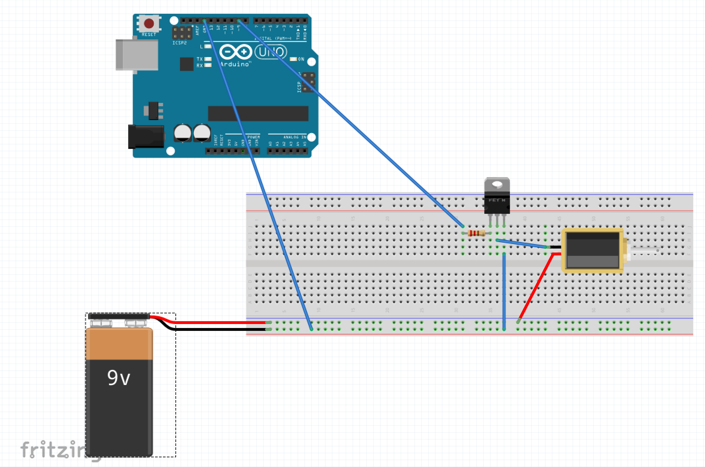

### Vision
According to the 2007 Annual Report from the American Printing House for the Blind, there are approximately 57,696 legally blind children in the U.S. Out of those school-age children, only 10 percent use Braille as their primary reading medium.
Furthemore, the number of people of all ages visually impaired is estimated to be 285 million, of whom 39 million are blind. Most of them are suffering poverty or living within warzones.
In order to help these people we have decided to prototype an open source refreshable braille display using the very basic principles of IoT and one of the most popular programming language: JavaScript. This repository works as a starting point for this journey

### What's a refreshable braille display ?

A refreshable braille display or braille terminal is an electro-mechanical device for displaying braille characters, usually by means of round-tipped pins raised through holes in a flat surface. Visually impaired computer users who cannot use a computer monitor can use it to read text output. Speech synthesizers are also commonly used for the same task, and a blind user may switch between the two systems or use both at the same time depending on circumstances. Deafblind computer users may also use refreshable braille displays.

### How this prototype looks like ?

### Hardware needed
In order to get started you are going to need:
- An Arduino board or any other board compatible with [Johnny Five](http://johnny-five.io/platform-support/). Depending on the GPIO pins of the board you can expand the prototype. Without any modifications each braille unit requires 6 GPIO pins. An Arduino UNO is highly recommended.
- A few jumper wires
- A breadboard
- 6 5V solenoids per braille unit
- 6 MOSFETs (irf540n) per braille unit
- 6  ~480 ohm resistors per braille unit
- Power source: You can control 2 solenoids using a single 9V battery.
- A few M3 screws

### 3D parts
All the mechanical parts are modular and can fit into a sigle unit. You can print each braille unit using a 3D printer or order them through a 3D printing hub. The designs can be found [here](./3d_parts).

### Software needed
You need to install the [Arduino IDE](https://www.arduino.cc/en/Main/Software) and also install [Node.js and NPM](https://nodejs.org/en/download/).

### Start developing with Johnny Five
In to order to start coding the prototype you need to check that the Arduino is properly connected and loaded with the Firmdata prototocol. You can take a look at this [tutorial](https://www.pubnub.com/blog/2016-05-25-howcreate-a-smart-device-with-arduino-and-node-js-using-johnny-five/) for more information.

_Pro tip:_ Start small. You can purchase an Arduino and few LED light as a starter kit, try to play around with the Johnny Five framework, configure your development station and aftewards

### Schematics / Circuit
Each solenoid is controlled through an Arduino pin. Solenoids are wired with a MOSFET and a resistor. All solenoids are sharing the same ground with the Arduino. A rough sketchup of a solenoid connected with the Arduino looks like this.

## License
MIT, see the [LICENSE](./LICENSE.md) file.

## Resources
- http://www.braille.org/papers/jvib0696/vb960329.htm
- https://lincs.ed.gov/publications/pdf/LiteracyEmployment2010.pdf
- http://www.who.int/blindness/publications/globaldata/en/
- http://www.who.int/news-room/fact-sheets/detail/blindness-and-visual-impairment